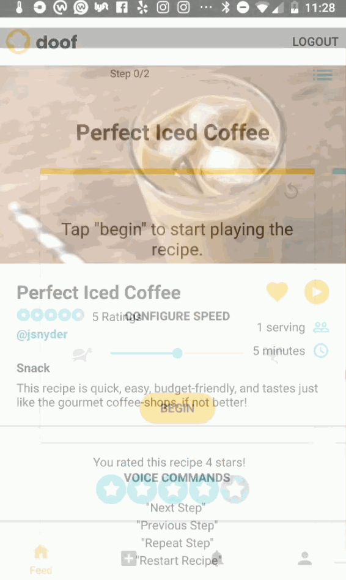

# Doof

Cooking is messy, and people like keeping their devices clean (and their food free of germs). Doof is an Android app that offers the unique feature of a hands-free cooking experience through voice controlled, step by step audio feedback to complete the recipe. It allows users to upload their own recipes and interact with recipes created by other users, which enhance the cooking experience by incorporating this social aspect.

Time spent: 4 weeks
Built with: [Parse](https://parseplatform.org/), [PocketSphinx](https://github.com/cmusphinx/pocketsphinx), [Glide](https://github.com/bumptech/glide), [Konfetti](https://github.com/DanielMartinus/Konfetti), [ButterKnife](https://github.com/JakeWharton/butterknife)

## User Stories

The following **required** functionality is completed:

* [x] The recipe will be read aloud
* [x] The user will be able to scroll through a list of recipes
* [x] The recipes will produce a detail screen when clicked
* [x] The app will be able to register when the user says commands such as "Next Step", "Previous Step", "Repeat Step", and "Restart Recipe", and respond accordingly

The following **optional** features are implemented:

**Login and Signup**
* [x] Users can log in and log out of their accounts
* [x] CurrentUser is persisted across sessions (closing and resuming the app)
* [x] New users can be created through sign up

**Feed**
* [x] There will be a search function and a filter to narrow the list of recipes.
  * [x] Options for name, max prep time, rating, and food type.
  * [x] Filter is persisted through opening and closing the filter window
* [x] Main feed features infinite scrolling.
* [x] Search bar automatically filters recipes as user types, and displays options for autocompletion.
* [x] Each recipe displays a view count, image, prep time, description, rating, and type.

**Profile**
* [x] Users have a profile page.
  * [x] Within the profile page are nested fragments for their own recipes, favorited recipes, and completed recipes.
  * [x] Profile page keeps track of recipes contributed (by that user), recipes reviewed (rated), and recipes completed.
  * [x] Users are able to edit their profile page, such as adding a description and changing their profile picture.
* [x] Users can delete their own recipes via long click
  
**Notifications**
* [x] Users receive notifications when other users interact with their recipes.
  * [x] Other users' profiles can be accessed through the notification.
  * [x] The recipe details can be accessed through the notification.

**Adding Recipes**
* [x] Ability for the user to add/import their own saved recipes into the app database.
  * [x] Users are prohibited from leaving fields blank
  * [x] Drop down options for category constraints
  * [x] Users can upload a photo for each recipe
  * [x] Users can add as many steps and ingredients as needed and delete them in any order on long click
  * [x] Add and Remove steps buttons autoscroll the screen as they are clicked
  * [x] Content inputted is saved when changing tabs in navigation menu

**Recipe Details**
* [x] User can edit their own recipes via the detail screens
* [x] Recipe details page displays full recipe information
  * [x] Recipe photo features pull to zoom
  * [x] Users can rate each recipe, and the overall rating for that recipe is an average of all users' input.
  * [x] Users can "favorite" recipes, and that recipe will appear on their favorites tab (on the profile)
  * [x] Speech activity is launched from this page
  * [x] Profile page (including their recipes) of user who contributed that recipe can be accessed by clicking their handle
  
**Speech Activity**
* [x] While recipe is being played, there is a user progress bar.
  * [x] Recipe progress persists across configuration changes
  * [x] Steps are displayed in card views in a view pager
  * [x] User can stop, pause, replay, and resume recipe dictation / speech recognition
  * [x] User can configure speed of recipe dictation
  * [x] Relevant ingredients are listed beneath each step while a popup can be toggled to view full ingredient list
  * [x] App automatically updates recipes completed count upon reaching the last step and displays confetti
  
**Misc**
* [x] Transition animations between fragments
* [x] Empty state images for notifications and profile tabs
* [x] Fragments and tabs are persisted across configuration changes

The following **stretch goals** are implemented:

* [ ] Push Notifications!
* [ ] An automatic timer that starts when a timed instruction is read (e.g. baking time, thawing time, etc.)
* [ ] Users can record each step themselves to upload audio.

## Wireframe
https://www.figma.com/file/XeCmflnw8JHiKel1N4hADTbL/AMarMigMon

## Video Walkthrough

Here's a walkthrough of implemented user stories. In the speech activity, instructions should be read aloud automatically upon pressing the begin button. The "next step" voice command is demonstrated below.

GIF created with [LiceCap](http://www.cockos.com/licecap/).

