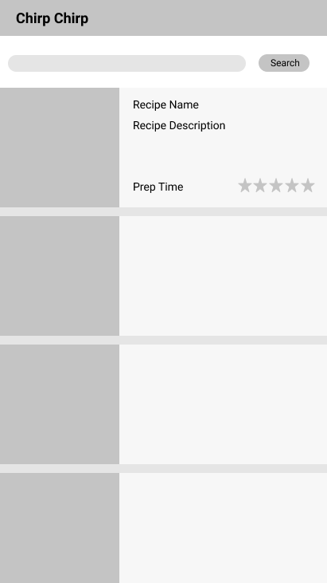
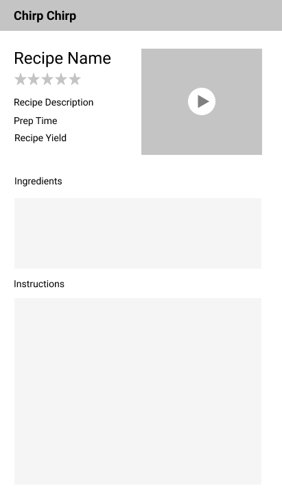

# FoodApp

___________ [Insert app name here] is an app that provides the user with a list of recipes catered to their needs. It will offer the unique feature of a hands-free cooking experience through voice controlled, step by step audio feedback to complete the recipe.

Time spent: [__] hours spent in total

## User Stories

The following **required** functionality is completed:

* [ ] The recipe will be read aloud
* [ ] The user will be able to scroll through a list of recipes
* [ ] The recipes will produce a detail screen when clicked
* [ ] The app will be able to register when the user says commands such as "start", "pause", "repeat", and "stop", and respond accordingly

The following **optional** features are implemented:

* [ ] There will be a search function to narrow the list of recipes
  * [ ] Options for prep time, price, ingredients, difficulty
* [ ] Additional activity for nutritional information
* [ ] Ability for the user to add/import their own saved recipes into the app database

The following **stretch goals** are implemented:

* [ ] An automatic timer that starts when a timed instruction is read (e.g. baking time, thawing time, etc.)

The following **additional** features are implemented:

* [ ] 

## Wireframe
 

https://www.figma.com/file/XeCmflnw8JHiKel1N4hADTbL/AMarMigMon

## Video Walkthrough

Here's a walkthrough of implemented user stories:

GIF created with [LiceCap](http://www.cockos.com/licecap/).

## Notes

Describe any challenges encountered while building the app:

## Open-source libraries used

- [Android Async HTTP](https://github.com/loopj/android-async-http) - Simple asynchronous HTTP requests with JSON parsing
- API endpoints: 

## Considerations
1. What is your product pitch?
   - Start with a problem statement and follow up with a solution.
   - Focus on engaging your audience with a relatable need.
   The assumption is that people dislike interacting with their devices while cooking, as cooking tends to be hands-on and messy. However, nowadays, people commonly access recipes online, through such devices.
   Cooking is messy, and people like keeping their devices clean (and their food free of germs).
   WE PROVIDE A HANDS FREE COOKING EXPERIENCE THROUGH THE AUDIO FEATURE OF THIS APP.
   
2. Who are the key stakeholders for this app?
   - Who will be using this?
     Anyone who cooks through recipes
   - What will they be using this for?
     Following the steps of the recipes without the need to touch electronic devices while doing so
   
3. What are the core flows?
   - What are the key functions?
     
   - What screens will each user see?
   
4. What will your final demo look like?
   - Describe the flow of your final demo
   
5. What mobile features do you leverage?
   - Leverage at least two mobile-oriented features (i.e. maps and camera)
   
6. What are your technical concerns?
   - What technical features do you need help or resources for?

## License

